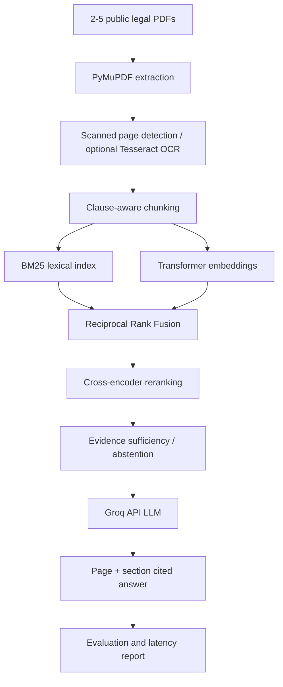

# LexiSyncAI architecture

```mermaid
flowchart TD
 A[2-5 public legal PDFs] --> B[PyMuPDF extraction]
 B --> C[Scanned page detection / optional Tesseract OCR]
 C --> D[Clause-aware chunking]
 D --> E[BM25 lexical index]
 D --> F[Transformer embeddings]
 E --> G[Reciprocal Rank Fusion]
 F --> G
 G --> H[Cross-encoder reranking]
 H --> I[Evidence sufficiency / abstention]
 I --> J[Groq API LLM]
 J --> K[Page + section cited answer]
 K --> L[Evaluation and latency report]
```
